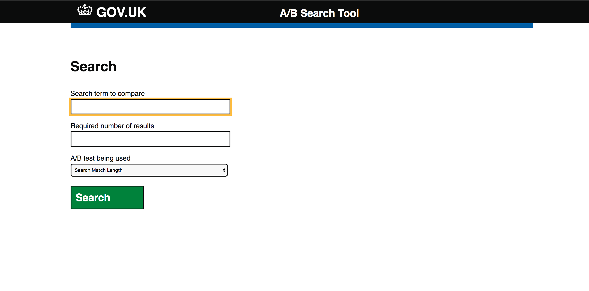
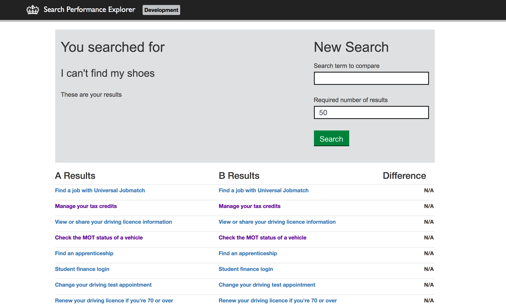

# Search Performance Explorer
Tools for exploring how the GOV.UK search is performing and comparing multiple implementations to each other.

## Technical documentation
This is a Ruby on Rails application that compares the results of an A/B test.

The repository also contains some other utilities for developing and testing search.

## Live version
There is a live version of this application running at https://infinite-escarpment-22010.herokuapp.com/

## Running the web application
* Clone this repository
* `bundle install`
* `bundle exec rails s -p 3000`
* The application will now run on localhost:3000

## Running the command line checks
See [benchmarking search using the health check script](health-check.md).

### Rake tasks
Run `rake 'debug:explain[your search query]'` to get a simplified Elasticsearch explain plan for any search query. This can be used to understand why particular results are showing up in the search results.

## Running the tests
`bundle exec rake`

## Screenshots

